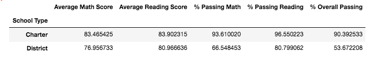

# Report in School District Analysis
## Overview
In this report, we analyze the data on student funding and students' standardized test scores to draw insights on the performance of the high schools in order to assist the school board and the superintendent in making decisions regarding the school budget and priorities. We perform our analyses at the district level, school level and grade level to uncover the underlying trends. Due to some evidence of academic dishonesty at math and reading testing scores by 9th graders at Thomas High School (THS), we repeat these same analyses excluding the test scores of the 9th graders at THS. Our report includes a detailed comparative analysis of the results with and without the 9th graders' test scores.

## Results
* The school district consists of 15 high schools.
* There are two types of schools in the school district: Charter and District. 
* The total number of students in the school district is 39,170.
* The total budget is $24,649,428.
* The district summary table below shows the analysis results from the original data.

* The district summary table below shows the analysis results excluding the test scores of 9th graders in THS.

* When we compare the results from the two tables we can see that the difference is very small. It is so small that it is not possible to detect when the numbers are rounded. This is the reason tables with unformatted results are displayed here. Tables with formatted results are also included in the Resources folder for further reference.
* After excluding the test scores of 9th graders from THS:
    * The average math and reading score, the percentage of students passing reading and math and the overall percentage of passing declined.
* The table below displays the school summary for THS with the 9th graders' test score included.

* The table below displays the school summary for THS excluding the 9th graders' test scores.

* Again, we notice a slight decrease in all of the performance metrics after we exclude 9th graders' test scores from the analysis. The performance metrics for other schools are not affected by this change as no change was made to their data. 
* In our analysis we also investigated if the relative performance of THS was affected by this change. 
* The table below shows the top five high performing schools inthe district. We can see that THS is the second highest performing school in the school district.

* The table below shows the top five high performing schools in the district after the data has been altered.

* We notice that even though the overall performance of THS has declined slightly after removing the test scores of 9th graders, this change did not impact its performance compared to other schools in the district. THS was still the second best performing school in the district.
* We also performed grade-level analysis of the average math and reading scores of the 9th graders in all of the 15 schools in the district.
* Our analysis indicates slight decrease in both the average reading and math scores of the 9th graders.
* The average math score of 9th graders in the district decreased from 80.351617 to 80.120302.
* The average reading score of the 9th graders in the district decreased from 82.513318 to 82.426494. (Please refer to Cells 53 and 54 PyCitySchools_Challenge jupyter notebook file to see the calculation)
* The test scores of 10th, 11th and 12th graders at THS and the other schools have not been affected by this as there was no change affecting the calculation of their scores.
* Finally, we performed analyses of scores by school spending per student, by school size and by school type. 
* We created fours spending bins for the purpose of aour analysis. THS's budget per student is $638, so it falls in the $630-$644 range (bin). That's why that is the range we are interested in. The other ranges will not be affected by the exclusion of the 9th graders's test scores in THS.
* The table below shows the summary of scores by school spending with the original data.

* The table below displays the summary of scores by school spending after the data has been modified to exclude the scores of the 9th graders in THS.

* The results indicate slight decrease in all of the scores for the $630-$644 range except the average reading score which has increased from 81.62447 to 81.63626.

* When we analyze the test scores by the school size we group the schools into three categories: small, medium and large. THS has 1,635 students, so it is in the medium size group (1,000-2,000 students). This is the category we examine to see if there was any change.
* The table below shows the summary table for scores by school size in the original data.

* The table below shows the summary table for scores by school size in the data without the 9th graders.

* Similar to the results of the scores by school spending, all scores in the medium size school category have declined except the average reading score which has slightly increased.
* Finally we investigate how the test scores accross the school type. The table below shows the summary table of scores by school type with the original data.

* Since THS is a charter school we only expect changes in the charter school cetagory if any. The summary table of scores by school type with the altered data is displayed below.

* When we compare the results of the original data and the changed data we notice that similar to the results of the scores by spending and by size, the scores after the 9th graders were excluded from the data are lower than the scores from the original data set with the 9th graders except the average reading score. However, this change is minimal and not even noticable when the numbers are rounded to the nearest decimal place.

## Summary

The results of the School District analyses indicate that after the test scores of the 9th graders in the THS have been replaced there were only very small changes in the metrics measured. After replacing the test scores of the 9th graders in THS, the average math and reading scores, the percentage of students passing reading and math and the overall percentage of passing declined. The reason of the small impact in the metrics could be due to the small number of data points that have been altered: the total number of students in the district is 39,170 and the numbers of 9th graders in THS is only 461. Hence, we do not expect a large impact as a result of this change. When we look at the change only among 9th graders in the district though, the impact is a little bit more obvious. The average scores of math and reading for all ofthe 9th graders have declined. The results also show that the relative performance of THS has not been affected by this change even though there has been slight decline in its absolute performance. Replacing the scores has also affected the scores by school spending, school size and school type metrics in the group THS is in.
